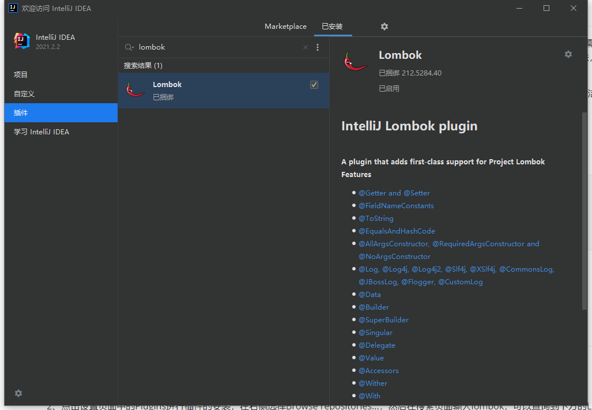
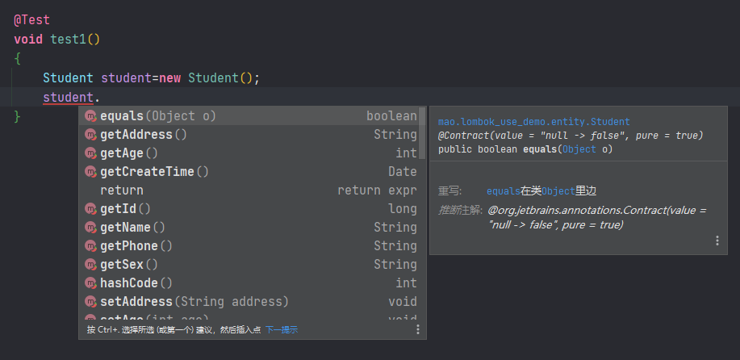

[TOC]


# lombok

## 介绍

lombok是一个开源的代码生成库，能以简单的注解形式来简化Java类中的大量样板代码，提高开发人员的开发效率。例如开发中经常需要写的javabean，都需要花时间去添加相应的getter/setter，也许还要去写构造器、equals等方法，而且需要维护，当属性多时会出现大量的getter/setter方法，这些显得很冗长也没有太多技术含量。

lombok能通过注解的方式，在编译时自动为属性生成构造器、getter/setter、equals、hashcode、toString方法，使代码看起来更简洁。


lombok对应的maven坐标：


```xml
<dependency>
    <groupId>org.projectlombok</groupId>
    <artifactId>lombok</artifactId>
    <version>1.18.10</version>
</dependency>
```


## 安装lombok插件

要使用lombok需要在IDE中安装对应的lombok插件。本课程使用的开发工具为IntelliJ IDEA，安装插件过程如下：

1、打开IntelliJ IDEA后点击菜单栏中的File-->Settings进入到设置页面

2、点击设置页面中的Plugins进行插件的安装，在右侧选择Browse repositories...，然后在搜索页面输入lombok，可以查询到下方的Lombok Plugin，鼠标点击Lombok Plugin可在右侧看到Install按钮，点击该按钮便可安装





## lombok常用注解


|           注解           |                             说明                             |
| :----------------------: | :----------------------------------------------------------: |
|         @Setter          | 注解在类或属性，注解在类时为所有属性生成setter方法，注解在属性上时只为该属性生成setter方法 |
|         @Getter          |        使用方法同@Setter，区别在于生成的是getter方法         |
|        @ToString         |                  注解在类，添加toString方法                  |
|    @EqualsAndHashCode    |              注解在类，生成hashCode和equals方法              |
|    @NoArgsConstructor    |                 注解在类，生成无参的构造方法                 |
| @RequiredArgsConstructor | 注解在类，为类中需要特殊处理的属性生成构造方法，比如final和被@NonNull注解的属性 |
|   @AllArgsConstructor    |           注解在类，生成包含类中所有属性的构造方法           |
|          @Data           | 注解在类，生成setter/getter、equals、canEqual、hashCode、toString方法，如为final属性，则不会为该属性生成setter方法 |
|          @Slf4j          |             注解在类，生成log变量，用于记录日志              |
|         @Builder         |                     将类转变为建造者模式                     |


## 示例


第一步：创建工程**lombok_use_demo**


第二步：更改pom文件，导入lombok依赖


```xml
<?xml version="1.0" encoding="UTF-8"?>
<project xmlns="http://maven.apache.org/POM/4.0.0" xmlns:xsi="http://www.w3.org/2001/XMLSchema-instance"
         xsi:schemaLocation="http://maven.apache.org/POM/4.0.0 https://maven.apache.org/xsd/maven-4.0.0.xsd">
    <modelVersion>4.0.0</modelVersion>

    <parent>
        <groupId>org.springframework.boot</groupId>
        <artifactId>spring-boot-starter-parent</artifactId>
        <version>2.7.1</version>
        <relativePath/> <!-- lookup parent from repository -->
    </parent>

    <groupId>mao</groupId>
    <artifactId>lombok_use_demo</artifactId>
    <version>0.0.1-SNAPSHOT</version>
    <name>lombok_use_demo</name>
    <description>lombok_use_demo</description>
    
    <properties>
        <java.version>11</java.version>
    </properties>
    
    <dependencies>
        <dependency>
            <groupId>org.springframework.boot</groupId>
            <artifactId>spring-boot-starter</artifactId>
        </dependency>

        <dependency>
            <groupId>org.springframework.boot</groupId>
            <artifactId>spring-boot-starter-test</artifactId>
            <scope>test</scope>
        </dependency>

        <!--spring-boot lombok-->
        <dependency>
            <groupId>org.projectlombok</groupId>
            <artifactId>lombok</artifactId>
            <optional>true</optional>
        </dependency>

    </dependencies>

    <build>
        <plugins>
            <plugin>
                <groupId>org.springframework.boot</groupId>
                <artifactId>spring-boot-maven-plugin</artifactId>
            </plugin>
        </plugins>
    </build>

</project>
```


第三步：创建Student实体类


```java
package mao.lombok_use_demo.entity;

import java.util.Date;

/**
 * Project name(项目名称)：lombok_use_demo
 * Package(包名): mao.lombok_use_demo.entity
 * Class(类名): Student
 * Author(作者）: mao
 * Author QQ：1296193245
 * GitHub：https://github.com/maomao124/
 * Date(创建日期)： 2022/10/25
 * Time(创建时间)： 22:44
 * Version(版本): 1.0
 * Description(描述)： 无
 */

public class Student
{
    /**
     * id
     */
    private long id;
    /**
     * 名字
     */
    private String name;
    /**
     * 性
     */
    private String sex;
    /**
     * 年龄
     */
    private int age;
    /**
     * 地址
     */
    private String address;

    /**
     * 电话
     */
    private String phone;

    /**
     * 创建时间
     */
    private Date createTime;
    
}
```


第四步：加入lombok提供的注解


```java
package mao.lombok_use_demo.entity;

import lombok.AllArgsConstructor;
import lombok.Builder;
import lombok.Data;
import lombok.NoArgsConstructor;

import java.util.Date;

/**
 * Project name(项目名称)：lombok_use_demo
 * Package(包名): mao.lombok_use_demo.entity
 * Class(类名): Student
 * Author(作者）: mao
 * Author QQ：1296193245
 * GitHub：https://github.com/maomao124/
 * Date(创建日期)： 2022/10/25
 * Time(创建时间)： 22:44
 * Version(版本): 1.0
 * Description(描述)： 无
 */

@Data
@NoArgsConstructor
@AllArgsConstructor
@Builder
public class Student
{
    /**
     * id
     */
    private long id;
    /**
     * 名字
     */
    private String name;
    /**
     * 性
     */
    private String sex;
    /**
     * 年龄
     */
    private int age;
    /**
     * 地址
     */
    private String address;

    /**
     * 电话
     */
    private String phone;

    /**
     * 创建时间
     */
    private Date createTime;

}
```


第五步：测试


加入日志注解@Slf4j





测试1：

```java
package mao.lombok_use_demo;

import lombok.extern.slf4j.Slf4j;
import mao.lombok_use_demo.entity.Student;
import org.junit.jupiter.api.Test;
import org.springframework.boot.test.context.SpringBootTest;

@SpringBootTest
@Slf4j
class LombokUseDemoApplicationTests
{

    @Test
    void contextLoads()
    {
    }

    @Test
    void test1()
    {
        Student student=new Student();
        student.setId(2L);
        student.setName("张三");
        student.setAge(18);
        log.info(student.toString());
    }
}
```


```sh
2022-10-25 22:52:49.742  INFO 19916 --- [           main] m.l.LombokUseDemoApplicationTests        : Student(id=2, name=张三, sex=null, age=18, address=null, phone=null, createTime=null)
```


测试2：

```java
package mao.lombok_use_demo;

import lombok.extern.slf4j.Slf4j;
import mao.lombok_use_demo.entity.Student;
import org.junit.jupiter.api.Test;
import org.springframework.boot.test.context.SpringBootTest;

@SpringBootTest
@Slf4j
class LombokUseDemoApplicationTests
{

    @Test
    void contextLoads()
    {
    }

    @Test
    void test1()
    {
        Student student = new Student();
        student.setId(2L);
        student.setName("张三");
        student.setAge(18);
        log.info(student.toString());
    }

    @Test
    void test2()
    {
        Student student = new Student();
        student.setId(2L);
        student.setName("张三");
        student.setAge(18);
        log.info(student.getName());
    }
}
```


```sh
2022-10-25 22:53:58.174  INFO 19016 --- [           main] m.l.LombokUseDemoApplicationTests        : 张三
```


测试3：

```java
package mao.lombok_use_demo;

import lombok.extern.slf4j.Slf4j;
import mao.lombok_use_demo.entity.Student;
import org.junit.jupiter.api.Test;
import org.springframework.boot.test.context.SpringBootTest;

@SpringBootTest
@Slf4j
class LombokUseDemoApplicationTests
{

    @Test
    void contextLoads()
    {
    }

    /**
     * test1 ，测试set方法和toString方法
     */
    @Test
    void test1()
    {
        Student student = new Student();
        student.setId(2L);
        student.setName("张三");
        student.setAge(18);
        log.info(student.toString());
    }

    /**
     * test2，测试get方法
     */
    @Test
    void test2()
    {
        Student student = new Student();
        student.setId(2L);
        student.setName("张三");
        student.setAge(18);
        log.info(student.getName());
    }

    /**
     * test3 ，测试equals和hashcode方法
     */
    @Test
    void test3()
    {
        Student student1 = new Student();
        student1.setId(2L);
        student1.setName("张三");
        student1.setAge(18);

        Student student2 = new Student();
        student2.setId(2L);
        student2.setName("张三");
        student2.setAge(19);

        Student student3 = new Student();
        student3.setId(2L);
        student3.setName("张三");
        student3.setAge(18);

        log.info("student1 equals student2:" + student1.equals(student2));
        log.info("student1 equals student3:" + student1.equals(student3));

        log.info("student1 hashcode:" + student1.hashCode());
        log.info("student2 hashcode:" + student2.hashCode());
        log.info("student3 hashcode:" + student3.hashCode());

    }
}

```


```sh
2022-10-25 22:57:09.792  INFO 18892 --- [           main] m.l.LombokUseDemoApplicationTests        : student1 equals student2:false
2022-10-25 22:57:09.792  INFO 18892 --- [           main] m.l.LombokUseDemoApplicationTests        : student1 equals student3:true
2022-10-25 22:57:09.792  INFO 18892 --- [           main] m.l.LombokUseDemoApplicationTests        : student1 hashcode:1131099724
2022-10-25 22:57:09.793  INFO 18892 --- [           main] m.l.LombokUseDemoApplicationTests        : student2 hashcode:1846024023
2022-10-25 22:57:09.793  INFO 18892 --- [           main] m.l.LombokUseDemoApplicationTests        : student3 hashcode:1131099724
```


测试4：

```java
package mao.lombok_use_demo;

import lombok.extern.slf4j.Slf4j;
import mao.lombok_use_demo.entity.Student;
import org.junit.jupiter.api.Test;
import org.springframework.boot.test.context.SpringBootTest;

import java.util.Date;

@SpringBootTest
@Slf4j
class LombokUseDemoApplicationTests
{

    @Test
    void contextLoads()
    {
    }

    /**
     * test1 ，测试set方法和toString方法
     */
    @Test
    void test1()
    {
        Student student = new Student();
        student.setId(2L);
        student.setName("张三");
        student.setAge(18);
        log.info(student.toString());
    }

    /**
     * test2，测试get方法
     */
    @Test
    void test2()
    {
        Student student = new Student();
        student.setId(2L);
        student.setName("张三");
        student.setAge(18);
        log.info(student.getName());
    }

    /**
     * test3 ，测试equals和hashcode方法
     */
    @Test
    void test3()
    {
        Student student1 = new Student();
        student1.setId(2L);
        student1.setName("张三");
        student1.setAge(18);

        Student student2 = new Student();
        student2.setId(2L);
        student2.setName("张三");
        student2.setAge(19);

        Student student3 = new Student();
        student3.setId(2L);
        student3.setName("张三");
        student3.setAge(18);

        log.info("student1 equals student2:" + student1.equals(student2));
        log.info("student1 equals student3:" + student1.equals(student3));

        log.info("student1 hashcode:" + student1.hashCode());
        log.info("student2 hashcode:" + student2.hashCode());
        log.info("student3 hashcode:" + student3.hashCode());

    }

    /**
     * test4，测试所有参数的构造方法
     */
    @Test
    void test4()
    {
        Student student = new Student(2009L, "李四", "女", 18, null, "18888888888", new Date());
        log.info(student.toString());
    }
}
```


```sh
2022-10-25 23:00:22.367  INFO 16072 --- [           main] m.l.LombokUseDemoApplicationTests        : Student(id=2009, name=李四, sex=女, age=18, address=null, phone=18888888888, createTime=Tue Oct 25 23:00:22 CST 2022)
```


测试5：

```java
package mao.lombok_use_demo;

import lombok.extern.slf4j.Slf4j;
import mao.lombok_use_demo.entity.Student;
import org.junit.jupiter.api.Test;
import org.springframework.boot.test.context.SpringBootTest;

import java.util.Date;

@SpringBootTest
@Slf4j
class LombokUseDemoApplicationTests
{

    @Test
    void contextLoads()
    {
    }

    /**
     * test1 ，测试set方法和toString方法
     */
    @Test
    void test1()
    {
        Student student = new Student();
        student.setId(2L);
        student.setName("张三");
        student.setAge(18);
        log.info(student.toString());
    }

    /**
     * test2，测试get方法
     */
    @Test
    void test2()
    {
        Student student = new Student();
        student.setId(2L);
        student.setName("张三");
        student.setAge(18);
        log.info(student.getName());
    }

    /**
     * test3 ，测试equals和hashcode方法
     */
    @Test
    void test3()
    {
        Student student1 = new Student();
        student1.setId(2L);
        student1.setName("张三");
        student1.setAge(18);

        Student student2 = new Student();
        student2.setId(2L);
        student2.setName("张三");
        student2.setAge(19);

        Student student3 = new Student();
        student3.setId(2L);
        student3.setName("张三");
        student3.setAge(18);

        log.info("student1 equals student2:" + student1.equals(student2));
        log.info("student1 equals student3:" + student1.equals(student3));

        log.info("student1 hashcode:" + student1.hashCode());
        log.info("student2 hashcode:" + student2.hashCode());
        log.info("student3 hashcode:" + student3.hashCode());

    }

    /**
     * test4，测试所有参数的构造方法
     */
    @Test
    void test4()
    {
        Student student = new Student(2009L, "李四", "女", 18, null, "18888888888", new Date());
        log.info(student.toString());
    }


    /**
     * test5
     */
    @Test
    void test5()
    {
        Student student = Student.builder().id(12L).name("张三").phone("1666666666").build();
        log.info(student.toString());
    }
}
```


```sh
2022-10-25 23:03:05.236  INFO 16048 --- [           main] m.l.LombokUseDemoApplicationTests        : Student(id=12, name=张三, sex=null, age=0, address=null, phone=1666666666, createTime=null)
```


## 反编译


从target目录里找到对应的实体类，反编译


```java
//
// Source code recreated from a .class file by IntelliJ IDEA
// (powered by FernFlower decompiler)
//

package mao.lombok_use_demo.entity;

import java.util.Date;

public class Student {
    private long id;
    private String name;
    private String sex;
    private int age;
    private String address;
    private String phone;
    private Date createTime;

    public static Student.StudentBuilder builder() {
        return new Student.StudentBuilder();
    }

    public long getId() {
        return this.id;
    }

    public String getName() {
        return this.name;
    }

    public String getSex() {
        return this.sex;
    }

    public int getAge() {
        return this.age;
    }

    public String getAddress() {
        return this.address;
    }

    public String getPhone() {
        return this.phone;
    }

    public Date getCreateTime() {
        return this.createTime;
    }

    public void setId(final long id) {
        this.id = id;
    }

    public void setName(final String name) {
        this.name = name;
    }

    public void setSex(final String sex) {
        this.sex = sex;
    }

    public void setAge(final int age) {
        this.age = age;
    }

    public void setAddress(final String address) {
        this.address = address;
    }

    public void setPhone(final String phone) {
        this.phone = phone;
    }

    public void setCreateTime(final Date createTime) {
        this.createTime = createTime;
    }

    public boolean equals(final Object o) {
        if (o == this) {
            return true;
        } else if (!(o instanceof Student)) {
            return false;
        } else {
            Student other = (Student)o;
            if (!other.canEqual(this)) {
                return false;
            } else if (this.getId() != other.getId()) {
                return false;
            } else if (this.getAge() != other.getAge()) {
                return false;
            } else {
                label76: {
                    Object this$name = this.getName();
                    Object other$name = other.getName();
                    if (this$name == null) {
                        if (other$name == null) {
                            break label76;
                        }
                    } else if (this$name.equals(other$name)) {
                        break label76;
                    }

                    return false;
                }

                Object this$sex = this.getSex();
                Object other$sex = other.getSex();
                if (this$sex == null) {
                    if (other$sex != null) {
                        return false;
                    }
                } else if (!this$sex.equals(other$sex)) {
                    return false;
                }

                label62: {
                    Object this$address = this.getAddress();
                    Object other$address = other.getAddress();
                    if (this$address == null) {
                        if (other$address == null) {
                            break label62;
                        }
                    } else if (this$address.equals(other$address)) {
                        break label62;
                    }

                    return false;
                }

                label55: {
                    Object this$phone = this.getPhone();
                    Object other$phone = other.getPhone();
                    if (this$phone == null) {
                        if (other$phone == null) {
                            break label55;
                        }
                    } else if (this$phone.equals(other$phone)) {
                        break label55;
                    }

                    return false;
                }

                Object this$createTime = this.getCreateTime();
                Object other$createTime = other.getCreateTime();
                if (this$createTime == null) {
                    if (other$createTime != null) {
                        return false;
                    }
                } else if (!this$createTime.equals(other$createTime)) {
                    return false;
                }

                return true;
            }
        }
    }

    protected boolean canEqual(final Object other) {
        return other instanceof Student;
    }

    public int hashCode() {
        int PRIME = true;
        int result = 1;
        long $id = this.getId();
        int result = result * 59 + (int)($id >>> 32 ^ $id);
        result = result * 59 + this.getAge();
        Object $name = this.getName();
        result = result * 59 + ($name == null ? 43 : $name.hashCode());
        Object $sex = this.getSex();
        result = result * 59 + ($sex == null ? 43 : $sex.hashCode());
        Object $address = this.getAddress();
        result = result * 59 + ($address == null ? 43 : $address.hashCode());
        Object $phone = this.getPhone();
        result = result * 59 + ($phone == null ? 43 : $phone.hashCode());
        Object $createTime = this.getCreateTime();
        result = result * 59 + ($createTime == null ? 43 : $createTime.hashCode());
        return result;
    }

    public String toString() {
        long var10000 = this.getId();
        return "Student(id=" + var10000 + ", name=" + this.getName() + ", sex=" + this.getSex() + ", age=" + this.getAge() + ", address=" + this.getAddress() + ", phone=" + this.getPhone() + ", createTime=" + this.getCreateTime() + ")";
    }

    public Student() {
    }

    public Student(final long id, final String name, final String sex, final int age, final String address, final String phone, final Date createTime) {
        this.id = id;
        this.name = name;
        this.sex = sex;
        this.age = age;
        this.address = address;
        this.phone = phone;
        this.createTime = createTime;
    }

    public static class StudentBuilder {
        private long id;
        private String name;
        private String sex;
        private int age;
        private String address;
        private String phone;
        private Date createTime;

        StudentBuilder() {
        }

        public Student.StudentBuilder id(final long id) {
            this.id = id;
            return this;
        }

        public Student.StudentBuilder name(final String name) {
            this.name = name;
            return this;
        }

        public Student.StudentBuilder sex(final String sex) {
            this.sex = sex;
            return this;
        }

        public Student.StudentBuilder age(final int age) {
            this.age = age;
            return this;
        }

        public Student.StudentBuilder address(final String address) {
            this.address = address;
            return this;
        }

        public Student.StudentBuilder phone(final String phone) {
            this.phone = phone;
            return this;
        }

        public Student.StudentBuilder createTime(final Date createTime) {
            this.createTime = createTime;
            return this;
        }

        public Student build() {
            return new Student(this.id, this.name, this.sex, this.age, this.address, this.phone, this.createTime);
        }

        public String toString() {
            return "Student.StudentBuilder(id=" + this.id + ", name=" + this.name + ", sex=" + this.sex + ", age=" + this.age + ", address=" + this.address + ", phone=" + this.phone + ", createTime=" + this.createTime + ")";
        }
    }
}
```


---

end

---

by mao

2022  10  26

---

